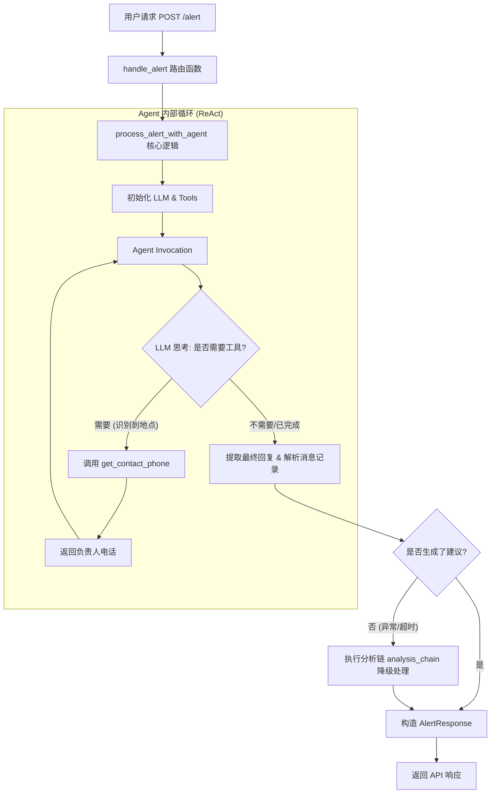

# 报警 Agent 工作流程说明

本文档整理了 `backend/app/api/v1/alert_agent/router.py` 中的报警处理 Agent 的核心逻辑、调用流程以及关键节点。

## 1. 核心功能描述

该功能实现了一个 **"观察-思考-行动" (Observation-Thought-Action)** 的智能体循环。它能够接收原始报警文本，识别其中的地理位置，自动查询相关负责人联系方式，并最终生成专业的巡检/修复建议。

## 2. 代码调用流程图



## 3. 关键节点解析

### 3.1 路由层 (Entry Point)

- **节点**: `@router.post("/alert")`
- **函数**: `handle_alert`
- **职责**: 接收 `AlertRequest`, 记录日志，并触发 Agent 处理。

### 3.2 工具层 (Tools)

- **节点**: `@tool get_contact_phone`
- **职责**:
  - 通过 `CONTACT_PHONE_MAP` 执行精确匹配。
  - 通过 `LOCATION_SYNONYMS` 执行模糊/同义词匹配（如：仓库 -> 库房）。
- **数据源**: 静态定义的地理位置与手机号映射表。

### 3.3 智能体层 (Agent Core)

- **技术栈**: LangChain `create_agent`
- **角色**: `智能报警处理助手`
- **核心逻辑**:
  1. **识别地点**: 从 "仓库着火了" 中提取 "仓库"。
  2. **决策行动**: 决定调用 `get_contact_phone(location="仓库")`。
  3. **综合信息**: 将 "仓库负责人电话" 与 "火灾报警" 结合，生成包含紧急程度、原因分析、步骤和人员联系的综合建议。

### 3.4 降级处理 (Fall-back)

- **节点**: `analysis_chain`
- **职责**: 如果 Agent 循环过程中未获取到最终建议，系统会启动一个纯 Prompt 的分析链，确保用户始终能得到一份检修建议，而不是报错。

## 4. 数据模型

- **输入 (`AlertRequest`)**: 仅需 `alert_message` (字符串)。
- **输出 (`AlertResponse`)**:
  - `original_alert`: 原始信息。
  - `tool_calls`: 记录了 Agent 到底调用了什么工具，输入输出是什么（增强可解释性）。
  - `maintenance_suggestion`: LLM 生成的最终建议。
  - `contact_info`: 提取出的负责人电话。

## 5. 如何调试

可以通过访问 `/health` 接口确认服务状态：

```bash
GET /api/v1/alert_agent/health
```

或者直接使用 Swagger UI 进行请求测试。
