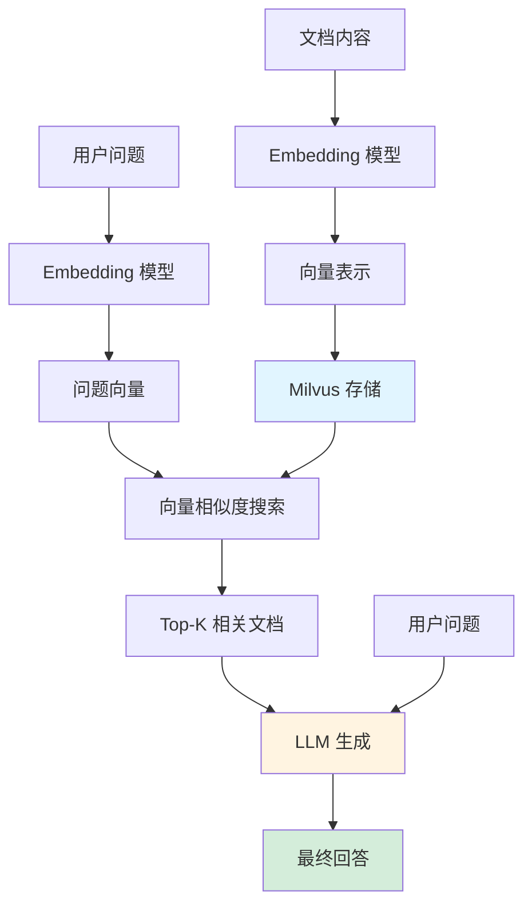

# LlamaIndex RAG 系统教学文档

> 版本: 1.0.0
> 更新日期: 2026-02-10
> 适用 LlamaIndex 版本: 0.10.x

本文档帮助你快速理解和使用基于 LlamaIndex 和 Milvus 的 RAG (检索增强生成) 系统。

## 目录

- [1. 核心概念](#1-核心概念)
  - [1.1 什么是 RAG](#11-什么是-rag)
  - [1.2 向量嵌入](#12-向量嵌入)
  - [1.3 Milvus 向量存储](#13-milvus-向量存储)
  - [1.4 RAG 工作流程](#14-rag-工作流程)
- [2. 环境配置](#2-环境配置)
- [3. API 使用指南](#3-api-使用指南)
  - [3.1 健康检查](#31-健康检查)
  - [3.2 索引文档](#32-索引文档)
  - [3.3 语义查询 (RAG)](#33-语义查询-rag)
  - [3.4 向量搜索](#34-向量搜索)
  - [3.5 删除集合](#35-删除集合)
- [4. 故障排查](#4-故障排查)

---

## 1. 核心概念

### 1.1 什么是 RAG

**RAG (Retrieval-Augmented Generation)** 是一种结合信息检索和生成式 AI 的技术架构。它解决了传统大语言模型的两个核心问题：

1. **知识幻觉** - 模型可能生成不准确的信息
2. **知识过期** - 模型无法知道训练之后发生的事情

**工作原理**：当你提问时，RAG 系统会先从你提供的文档库中检索相关内容，然后将这些内容作为上下文传递给 LLM，最后让 LLM 基于检索到的信息生成回答。

**示例流程**：
```
用户问题: "公司的请假政策是什么？"
↓
检索: 找到文档《员工手册》中关于"请假制度"的章节
↓
生成: LLM 基于检索到的政策内容，生成准确的回答
```

### 1.2 向量嵌入

**向量嵌入 (Embedding)** 是将文本转换为数字向量的技术。相似的文本会得到相似的向量。

**为什么需要向量？**
- 计算机无法直接理解文本的"含义"
- 向量空间中，距离近的向量 = 语义相似的文本
- 支持高效的相似度搜索

**示例**：
```
"猫很可爱"  → [0.23, -0.45, 0.67, ...]
"小猫很萌"  → [0.24, -0.44, 0.66, ...]  ← 向量相似
"汽车很快"  → [0.89, 0.12, -0.34, ...]  ← 向量差异大
```

**本项目使用**：智谱 AI 的 `embedding-3` 模型，生成 1024 维向量。

### 1.3 Milvus 向量存储

**Milvus** 是一个开源的向量数据库，专门用于存储和搜索海量向量数据。

**核心功能**：
- 存储向量嵌入及其关联的文档内容
- 快速执行相似度搜索（毫秒级）
- 支持数十亿级向量的检索

**部署方式**：
- **Zilliz Cloud** (推荐): 托管的 Milvus 服务，免运维
- **自建 Milvus**: 在自己的服务器上部署 Milvus

**本项目配置**：
- Collection 名称: `llamaindex_docs`
- 向量维度: 1024
- 相似度度量: 余弦相似度 (默认)

### 1.4 RAG 工作流程



**数据流向说明**：

1. **索引阶段** (A → D)
   - 文档通过 Embedding 模型转换为向量
   - 向量和原文一起存入 Milvus

2. **检索阶段** (E → I)
   - 用户问题也被转换为向量
   - 在 Milvus 中搜索最相似的文档片段

3. **生成阶段** (I, K → L)
   - 检索到的文档 + 用户问题 → LLM
   - LLM 生成基于事实的回答

---

## 2. 环境配置

### 2.1 必需的环境变量

在项目根目录的 `.env` 文件中配置以下变量：

```bash
# ===== LLM 配置 =====
LLM_API_KEY=your_zhipu_api_key_here          # 智谱 AI API Key
LLM_BASE_URL=https://open.bigmodel.cn/api/paas/v4/  # 智谱 API 地址
LLM_MODEL_ID=glm-4-flash                     # 模型名称 (可选)

# ===== Embedding 配置 =====
LLAMAINDEX_EMBEDDING_DIM=1024                # 向量维度 (embedding-3 固定 1024)

# ===== Milvus 配置 (两种方式二选一) =====

# 方式 1: Zilliz Cloud (推荐)
MILVUS_URI=https://your-cluster.api.gcp-us-west1.zillizcloud.com
MILVUS_TOKEN=your_token_here
MILVUS_COLLECTION=llamaindex_docs

# 方式 2: 自建 Milvus
# MILVUS_HOST=localhost
# MILVUS_PORT=19530
# MILVUS_USER=root
# MILVUS_PASSWORD=Milvus123
# MILVUS_COLLECTION=llamaindex_docs
```

### 2.2 获取 API Key

1. **智谱 AI**: 访问 [https://open.bigmodel.cn/](https://open.bigmodel.cn/) 注册并获取 API Key
2. **Zilliz Cloud**: 访问 [https://zilliz.com/](https://zilliz.com/) 创建免费集群

### 2.3 配置方式选择

| 配置方式 | 适用场景 | 优点 | 缺点 |
|---------|---------|------|------|
| **Zilliz Cloud** | 快速原型、生产环境 | 免运维、高可用 | 有免费额度限制 |
| **自建 Milvus** | 数据隐私要求高、大规模部署 | 完全控制、无额度限制 | 需要运维成本 |

**推荐**: 开发测试阶段使用 Zilliz Cloud 免费版。

---

## 3. API 使用指南

API 基础地址: `http://localhost:8000/api/v1/liama_index`

### 3.1 健康检查

检查 LLM 和 Milvus 连接状态。

**cURL 示例**:
```bash
curl -X GET "http://localhost:8000/api/v1/liama_index/health"
```

**Python 示例**:
```python
import requests

response = requests.get("http://localhost:8000/api/v1/liama_index/health")
print(response.json())
```

**响应示例**:
```json
{
  "success": true,
  "message": "Health check completed",
  "data": {
    "llm": "connected",
    "milvus": "configured"
  }
}
```

### 3.2 索引文档

将文档内容转换为向量并存入 Milvus。

**cURL 示例**:
```bash
curl -X POST "http://localhost:8000/api/v1/liama_index/index" \
  -H "Content-Type: application/json" \
  -d '{
    "text": "员工每年享有 15 天年假，需提前 3 天申请。",
    "metadata": {
      "source": "员工手册",
      "category": "休假制度"
    }
  }'
```

**Python 示例**:
```python
import requests

payload = {
    "text": "员工每年享有 15 天年假，需提前 3 天申请。",
    "metadata": {
        "source": "员工手册",
        "category": "休假制度"
    }
}

response = requests.post(
    "http://localhost:8000/api/v1/liama_index/index",
    json=payload
)
print(response.json())
```

**响应**:
```json
{
  "success": true,
  "message": "文档已成功索引并存入 Milvus"
}
```

**请求参数**:
| 参数 | 类型 | 必填 | 说明 |
|------|------|------|------|
| text | string | 是 | 要索引的文本内容 |
| metadata | object | 否 | 文档元数据，可用于过滤 |

### 3.3 语义查询 (RAG)

基于语义理解执行查询，LLM 会基于检索到的文档生成回答。

**cURL 示例**:
```bash
curl -X POST "http://localhost:8000/api/v1/liama_index/query" \
  -H "Content-Type: application/json" \
  -d '{
    "query": "年假有多少天？",
    "top_k": 3
  }'
```

**Python 示例**:
```python
import requests

payload = {
    "query": "年假有多少天？",
    "top_k": 3
}

response = requests.post(
    "http://localhost:8000/api/v1/liama_index/query",
    json=payload
)

result = response.json()
print("回答:", result["data"]["response"])
print("来源文档:", result["data"]["source_nodes"])
```

**响应**:
```json
{
  "success": true,
  "message": "查询成功",
  "data": {
    "response": "根据员工手册，员工每年享有 15 天年假。",
    "source_nodes": [
      {
        "score": 0.92,
        "text": "员工每年享有 15 天年假，需提前 3 天申请。..."
      }
    ]
  }
}
```

**请求参数**:
| 参数 | 类型 | 必填 | 默认值 | 说明 |
|------|------|------|--------|------|
| query | string | 是 | - | 查询问题 |
| top_k | integer | 否 | 3 | 检索的最相关文档数量 |

**与 `/search` 的区别**:
- `/query` 会调用 LLM 生成自然语言回答
- `/search` 只返回检索到的原始文档

### 3.4 向量搜索

纯检索模式，只返回最相似的文档，不调用 LLM 生成回答。适合需要展示来源或自己处理结果的场景。

**cURL 示例**:
```bash
curl -X POST "http://localhost:8000/api/v1/liama_index/search" \
  -H "Content-Type: application/json" \
  -d '{
    "query": "请假流程",
    "top_k": 5
  }'
```

**Python 示例**:
```python
import requests

payload = {
    "query": "请假流程",
    "top_k": 5
}

response = requests.post(
    "http://localhost:8000/api/v1/liama_index/search",
    json=payload
)

results = response.json()["data"]
for i, doc in enumerate(results, 1):
    print(f"\n文档 {i} (相似度: {doc['score']:.2f})")
    print(doc["text"])
```

**响应**:
```json
{
  "success": true,
  "message": "找到 2 个相关文档",
  "data": [
    {
      "score": 0.89,
      "text": "员工请假需提前填写申请表...",
      "metadata": {
        "source": "员工手册",
        "category": "休假制度"
      }
    }
  ]
}
```

### 3.5 删除集合

⚠️ **警告**: 此操作会删除整个 Milvus Collection，包括所有已索引的文档！

**cURL 示例**:
```bash
curl -X DELETE "http://localhost:8000/api/v1/liama_index/delete"
```

**Python 示例**:
```python
import requests

response = requests.delete("http://localhost:8000/api/v1/liama_index/delete")
print(response.json())
```

**响应**:
```json
{
  "success": true,
  "message": "集合 llamaindex_docs 已删除"
}
```

---

## 4. 故障排查

### 4.1 Milvus 连接失败

**错误信息**:
```
未配置 Milvus 连接信息 (URI 或 HOST/PORT)，请检查 .env 文件
```

**解决方案**:
1. 检查 `.env` 文件是否存在 `MILVUS_URI` 或 `MILVUS_HOST`
2. 确认 Zilliz Cloud URI 格式正确: `https://xxx.api.gcp-us-west1.zillizcloud.com`
3. 验证 Token 是否有效
4. 测试网络连通性: `ping your-cluster.api.gcp-us-west1.zillizcloud.com`

**调试命令**:
```python
# 测试 Milvus 连接
from pymilvus import connections
connections.connect("default", uri="your_uri", token="your_token")
print(connections.get_connection_addr("default"))
```

### 4.2 LLM API 调用失败

**错误信息**:
```
索引失败: Authentication failed
```

**解决方案**:
1. 验证 `LLM_API_KEY` 是否正确
2. 确认 `LLM_BASE_URL` 地址正确
3. 检查智谱 AI 账户余额
4. 测试 API 连接:

```bash
curl -X POST "https://open.bigmodel.cn/api/paas/v4/chat/completions" \
  -H "Authorization: Bearer YOUR_API_KEY" \
  -H "Content-Type: application/json" \
  -d '{"model": "glm-4-flash", "messages": [{"role": "user", "content": "Hi"}]}'
```

### 4.3 查询无结果

**症状**: `/query` 或 `/search` 返回空结果。

**可能原因**:
1. Milvus Collection 为空，没有索引任何文档
2. 查询问题与已索引文档语义不相关
3. Embedding 向量维度不匹配

**解决方案**:
1. 先使用 `/index` 索引一些测试文档
2. 检查 `top_k` 参数是否过小
3. 尝试更通用的查询词
4. 确认 `LLAMAINDEX_EMBEDDING_DIM=1024` 与模型一致

**调试命令**:
```bash
# 查询 Milvus Collection 中的文档数量
curl -X GET "http://localhost:8000/api/v1/liama_index/health"
# 查看 milvus 状态，如 Collection 是否存在
```

### 4.4 调试技巧

**开启详细日志**:
```python
import logging
logging.basicConfig(level=logging.DEBUG)
```

**检查 Milvus Collection**:
```python
from llama_index.vector_stores.milvus import MilvusVectorStore

store = MilvusVectorStore(
    uri="your_uri",
    token="your_token",
    collection_name="llamaindex_docs"
)

# 检查 Collection 是否存在
if store.client.has_collection("llamaindex_docs"):
    coll = store.client.get_collection("llamaindex_docs")
    print(f"文档数量: {coll.num_entities}")
```

**常见错误码**:
| 错误码 | 说明 | 解决方案 |
|--------|------|----------|
| 401 | API Key 无效 | 检查 `LLM_API_KEY` |
| 500 | Milvus 连接失败 | 检查 `MILVUS_URI` 和 Token |
| 503 | LLM 服务不可用 | 检查网络和 API 配额 |

---

## 附录

### 相关链接

- [LlamaIndex 官方文档](https://docs.llamaindex.ai/)
- [Milvus 官方文档](https://milvus.io/docs)
- [Zilliz Cloud](https://zilliz.com/)
- [智谱 AI 开放平台](https://open.bigmodel.cn/)

### 技术栈

- **LlamaIndex**: RAG 框架
- **Milvus**: 向量数据库
- **智谱 GLM**: LLM + Embedding 模型
- **FastAPI**: Web 框架

---

> 有问题？查看项目 README 或提交 Issue。
